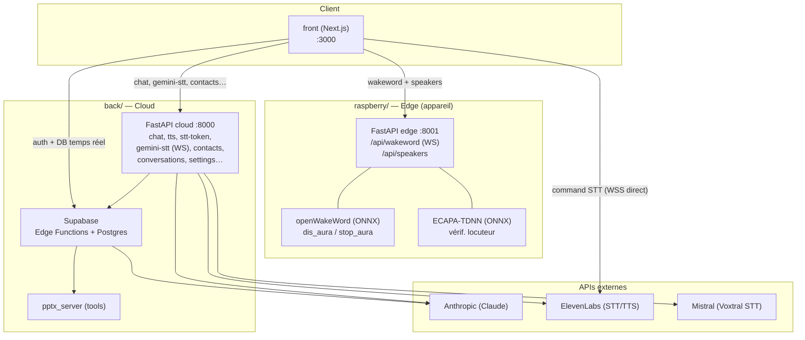
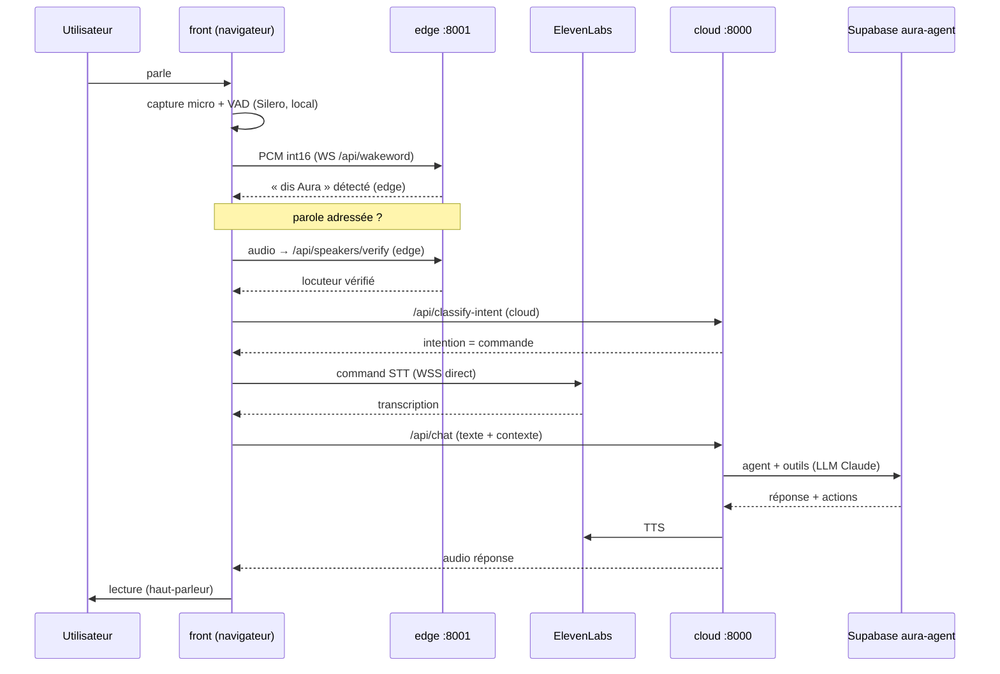
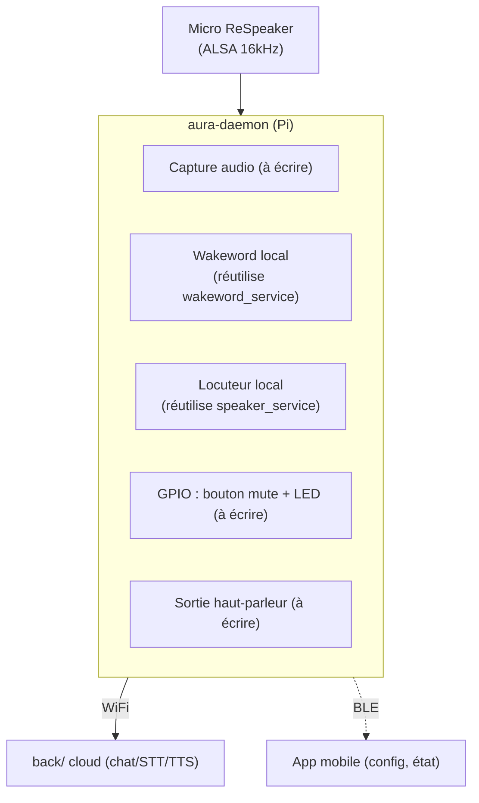

# Architecture — Aura Étoile

> Assistant vocal « dis Aura » : détection de mot d'activation et reconnaissance du locuteur sur l'appareil (edge), conversation et réponse vocale dans le cloud.
>
> Ce document décrit l'**état actuel** du monorepo (après séparation en 3 parties) **et** la **cible** « carte Raspberry autonome » (`aura-daemon`).

---

## 1. Vue d'ensemble

Le projet est un **monorepo** organisé en 3 parties déployables indépendamment, plus l'infra partagée :

```
aura-etoile/
├── front/         # Interface Next.js 16 (web)              → port 3000
├── back/          # Le « cloud »
│   ├── backend/   #   API FastAPI cloud (chat, STT, TTS…)   → port 8000
│   ├── supabase/  #   Edge Functions (agent LLM + outils) + Postgres
│   └── tools/pptx #   Générateur de présentations
├── raspberry/     # Le « edge » (appareil)
│   ├── backend/   #   API FastAPI edge (wakeword + locuteur) → port 8001
│   ├── openwake/  #   Modèles ONNX de mot d'activation
│   └── docs/      #   HARDWARE_PROTOTYPE.md, PLAN_OPENWAKEWORD…
├── nginx/         # Reverse proxy (prod) — à refondre
├── docker-compose.yml / deploy.sh
└── docs/          # HANDOFF.md, design/, ARCHITECTURE.md (ce fichier)
```

Trois responsabilités :

| Partie | Rôle | Techno | Où ça tourne |
|---|---|---|---|
| **front** | Interface utilisateur, capture micro (POC web), machine à états | Next.js 16 / React 19 | Navigateur / hébergeur web |
| **back** | Cerveau cloud : conversation (LLM), STT/TTS, intégrations, données | FastAPI + Supabase (Deno) | Serveur / VPS + Supabase |
| **raspberry** | Edge : mot d'activation + vérification du locuteur (offline, faible latence) | FastAPI + ONNX Runtime | Appareil (Raspberry Pi) |

---

## 2. Diagramme de déploiement



> **Point clé** : le `front` parle à **deux backends** — l'edge (`EDGE_URL`, :8001) pour wakeword/speakers, et le cloud (`BACKEND_URL`, :8000) pour tout le reste.

---

## 3. Composants détaillés

### 3.1 `front/` — Next.js 16 (port 3000)

Interface web. Capte le micro du navigateur, gère la machine à états de la session, affiche les transcriptions et pilote les appels aux backends.

- **Entrée** : `front/src/app/` (App Router : login, settings, contacts, discussions, summaries, activity).
- **Config** : `front/src/lib/constants.ts` → `BACKEND_URL` (`NEXT_PUBLIC_BACKEND_URL`, défaut :8000) et `EDGE_URL` (`NEXT_PUBLIC_EDGE_URL`, défaut :8001).
- **Accès API** : `front/src/lib/api.ts` (tous les appels HTTP).
- **Hooks principaux** :

| Hook | Rôle | Cible |
|---|---|---|
| `useAuraSession` | Orchestrateur, machine à états (idle→listening→thinking→speaking→conversing) | — |
| `useAudioCapture` | Capture micro navigateur, resampling PCM (AudioWorklet) | local |
| `useOpenWakeWord` | WS mot d'activation | **edge** `/api/wakeword` |
| `useDirectedSpeech` | Pipeline « parole adressée » : VAD + vérif locuteur + intent | edge + cloud |
| `useSileroVAD` | Détection d'activité vocale (ONNX, navigateur) | local |
| `useCommandSTT` | STT de commande | **ElevenLabs** (WSS direct) |
| `usePassiveSTT` | STT passive continue | **cloud** `/api/gemini-stt` |
| `useAudioPlayer` | Lecture des réponses TTS | local |
| `useAuth` | Authentification Supabase | Supabase |

### 3.2 `back/backend/` — FastAPI cloud (port 8000)

Le « cerveau » serveur. Entrée : `back/backend/app/main.py`.

| Route | Méthode | Rôle |
|---|---|---|
| `/api/chat` | POST | Conversation LLM (+ SSE streaming) |
| `/api/tts` | POST | Synthèse vocale (ElevenLabs) |
| `/api/stt-token` | GET | Token éphémère STT (ElevenLabs) |
| `/api/gemini-stt` | WS | Proxy STT passive (Mistral Voxtral) |
| `/api/conversations` (+ `/messages`) | CRUD | Historique des conversations |
| `/api/contacts` | CRUD | Contacts |
| `/api/discussions` | GET/DELETE | Fils de discussion |
| `/api/summaries` | GET/DELETE | Résumés |
| `/api/settings` | GET/PUT | Préférences utilisateur |
| `/api/activity` | GET | Journal d'activité |
| `/api/classify-intent` | POST | Classification d'intention |
| `/health` | GET | Sonde de vie |

- **Services** : `llm_service` (Anthropic), `tts_service` (ElevenLabs), `stt_service`, `context_service`, `summarization_service`, `supabase_client`.
- **Dépendances** : fastapi, uvicorn, httpx, anthropic, supabase, websockets, **wsproto**. (Pas d'openwakeword/onnxruntime/numpy — c'est l'edge.)

### 3.3 `back/supabase/` — Edge Functions + Postgres

Backend serverless (Deno) hébergé par Supabase. 15 fonctions :

- **`aura-agent`** — l'agent Claude avec ses outils (core, contacts, email, hubspot, slack, messaging, presentation, report, web, datagouv).
- **Outils/intégrations** : `calendar-api`, `contacts-api`, `hubspot-api`, `slack-api`, `send-email`, `send-sms`, `send-whatsapp`.
- **Audio/contexte** : `stt-proxy`, `scribe-token`, `transcribe-and-summarize`, `context-enrichment`, `summarize-context`.
- **Présentations** : `pptx-proxy` → appelle `back/tools/pptx/pptx_server.py`.
- **Partagé** : `_shared/auth.ts` (auth JWT).

### 3.4 `raspberry/backend/` — FastAPI edge (port 8001)

Détection on-device. Entrée : `raspberry/backend/app/main.py`.

| Route | Méthode | Rôle |
|---|---|---|
| `/api/wakeword` | WS | Reçoit du PCM int16, détecte « dis Aura » / « stop Aura » |
| `/api/speakers` | GET | Liste des locuteurs enrôlés |
| `/api/speakers/enroll` | POST | Enrôlement (audio → empreinte) |
| `/api/speakers/verify` | POST | Vérification du locuteur (cosinus) |
| `/api/speakers/{id}` | DELETE | Suppression |
| `/health` | GET | Sonde de vie |

- **Services** : `wakeword_service` (openWakeWord ONNX), `speaker_service` (ECAPA-TDNN ONNX, embeddings 192-dim), `supabase_client` (stockage des empreintes).
- **Modèles** : `raspberry/openwake/{dis_aura,stop_aura}.onnx` (résolus via `parents[3]/openwake`), `raspberry/backend/app/services/ecapa_tdnn.onnx` (Git LFS).
- **Dépendances** : fastapi, uvicorn, openwakeword, onnxruntime, numpy, websockets, **wsproto**, supabase.

### 3.5 Infra racine

- **`docker-compose.yml`** — définit aujourd'hui seulement le service edge (`8001:8000`, volume `raspberry/openwake`). *À compléter avec un service cloud.*
- **`nginx/nginx.conf`** — reverse proxy `/`→front, `/api/*`→un backend unique. *Obsolète : doit router vers 2 backends.*
- **`deploy.sh`** — déploiement Docker (VPS).

---

## 4. Flux audio bout-en-bout



| Étape | Où | Composant |
|---|---|---|
| Capture + VAD | local | `useAudioCapture`, `useSileroVAD` |
| Mot d'activation | **edge** | `wakeword_service` |
| Vérification locuteur | **edge** | `speaker_service` |
| Classification intention | **cloud** | `/api/classify-intent` |
| STT commande | **externe** | ElevenLabs (direct) |
| STT passive | **cloud** | `/api/gemini-stt` (Mistral) |
| Conversation + outils | **cloud** | `aura-agent` (Claude) |
| TTS | **cloud/externe** | `tts_service` → ElevenLabs |

---

## 5. Répartition edge vs cloud (réf. 5.1)

| Brique Aura | Mode | Implémentation actuelle |
|---|---|---|
| Mot d'activation « dis Aura » | **Appareil (préflashé)** | `raspberry` `wakeword_service` + `openwake/*.onnx` |
| Identification du locuteur | **Appareil** (empreintes téléchargées au setup) | `raspberry` `speaker_service` (ECAPA-TDNN) |
| Pré-traitement audio (réseau de micros) | **Appareil** | *cible device* (ReSpeaker + ALSA) — non implémenté |
| Conversation & réponse vocale | **Cloud** | `back/backend` + `aura-agent` + ElevenLabs |
| Empreintes vocales utilisateur | **Local + sync chiffrée cloud** | table `speaker_enrollments` (Supabase) |
| Mises à jour des modèles | **Téléchargement signé (cloud)** | *à définir* (OTA) |

---

## 6. Données (Supabase)

Tables principales (via `back/supabase/migrations/`) :

- `user_settings` (préférences, logo), `conversations`, `transcriptions`
- `contacts`, `activity_logs`
- Intégrations : `email_integrations`, `hubspot_integrations`, `slack_integrations`, `whatsapp_integrations`
- `calendar_events`, `sms_messages`
- **`speaker_enrollments`** — empreintes vocales (référence audio + embedding) ; vie locale sur l'appareil, synchronisée chiffrée vers le cloud.
- Buckets stockage : `presentations` (PPTX + PDF).

---

## 7. Cible device — `aura-daemon` (Raspberry Pi)

D'après `raspberry/docs/HARDWARE_PROTOTYPE.md` (Pi 5 + ReSpeaker 2-Mic HAT). Aujourd'hui le edge est un **serveur** qui reçoit l'audio d'un client ; la cible est un **daemon autonome** qui capte son propre micro.



**Existe vs à écrire :**

| Brique | État |
|---|---|
| Wakeword local | ✅ réutilisable (`wakeword_service.py`) |
| Vérification locuteur | ✅ réutilisable (`speaker_service.py`) |
| Capture micro locale (ALSA) | ❌ à écrire |
| Sortie audio (haut-parleur) | ❌ à écrire |
| GPIO bouton mute + LED | ❌ à écrire |
| Appels cloud (chat/STT/TTS) | ⚙️ à câbler vers `back/` |
| BLE (onboarding, état) | ❌ à écrire |

**États → couleurs LED** (ReSpeaker APA102) :

| État | Couleur | Animation |
|---|---|---|
| idle | Bleu `#3b82f6` | respiration lente |
| listening | Vert `#22c55e` | pulse rapide |
| thinking | Ambre `#f59e0b` | rotation |
| speaking | Violet `#8b5cf6` | pulse moyen |
| conversing | Cyan `#06b6d4` | pulse doux |
| mute | Rouge | fixe |
| error | Rouge `#ef4444` | clignotement |

---

## 8. Sécurité & RGPD

- **Bouton mute matériel** : coupe physiquement l'alimentation du micro via un MOSFET (GPIO 27). Même logiciel compromis ⇒ micro électriquement déconnecté.
- **Empreintes biométriques** : stockées localement sur l'appareil, synchronisées **chiffrées** vers le cloud ; restent attachées à l'utilisateur.
- **Auth** : JWT Supabase (transmis en `Bearer`), vérifié côté backends et Edge Functions (`_shared/auth.ts`).
- **CORS** : chaque backend FastAPI restreint les origines (`CORS_ORIGINS`, défaut `localhost:3000-3003`).
- **WebSocket** : démarrer uvicorn avec `--ws wsproto` (sinon handshake navigateur rejeté en 400 sous Windows).
- **Secrets** : `.env` non versionnés (gitignored) ; côté edge, seules les clés Supabase sont nécessaires.

---

## 9. Environnements & ports

**Développement local (3 terminaux) :**

| Service | Dossier | Commande | Port |
|---|---|---|---|
| Frontend | `front/` | `npm run dev` | 3000 |
| Cloud | `back/backend/` | `uvicorn app.main:app --port 8000 --ws wsproto` | 8000 |
| Edge | `raspberry/backend/` | `uvicorn app.main:app --port 8001 --ws wsproto` | 8001 |

> Edge : au 1er démarrage, télécharger les modèles de base openWakeWord :
> `python -c "import openwakeword; openwakeword.utils.download_models()"`

**Production** : `nginx` route `/`→front, et doit router `/api/wakeword` + `/api/speakers`→edge, le reste→cloud (refonte nécessaire, cf. §10).

---

## 10. État & dette technique

**Fonctionne :**
- Séparation 3 dossiers effectuée ; historique préservé (renommages git).
- `front` câblé : `BACKEND_URL` (cloud) vs `EDGE_URL` (edge) ; les 2 backends vérifiés de bout en bout (navigateur réel).
- Cloud `back/backend` restauré et nettoyé (routes cloud uniquement).

**À faire :**
- **Refondre `nginx.conf` + `docker-compose.yml` + `deploy.sh`** pour la topologie à 3 cibles (front, cloud, edge) — aujourd'hui orientés mono-backend.
- **Construire le `aura-daemon`** (capture ALSA, GPIO/LED, sortie HP, appels cloud) — cf. §7.
- **OTA** : mécanisme de mise à jour signée des modèles.
- Nettoyage optionnel de `raspberry/backend/requirements.txt`.
- **Rien n'est commité** : les changements (split + restauration cloud + câblage) sont dans le working tree.

---

*Document de référence — à tenir à jour quand l'architecture évolue. Voir aussi `docs/HANDOFF.md` (détails fonctionnels) et `raspberry/docs/HARDWARE_PROTOTYPE.md` (matériel).*
